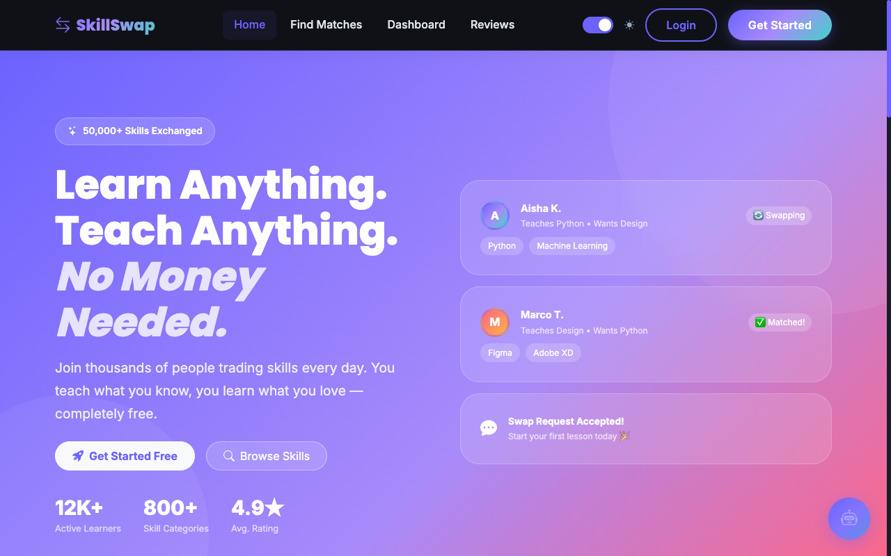
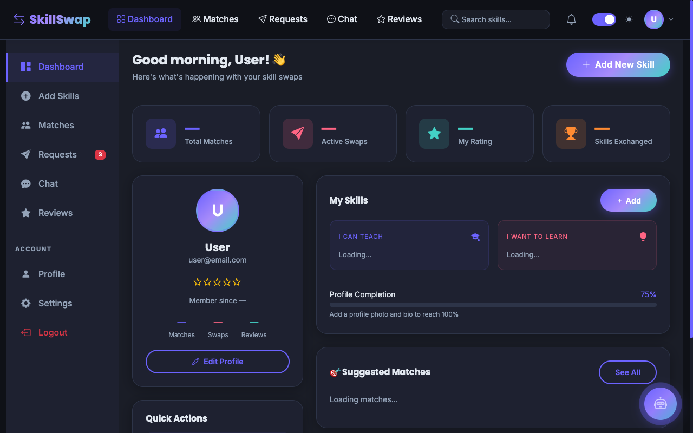
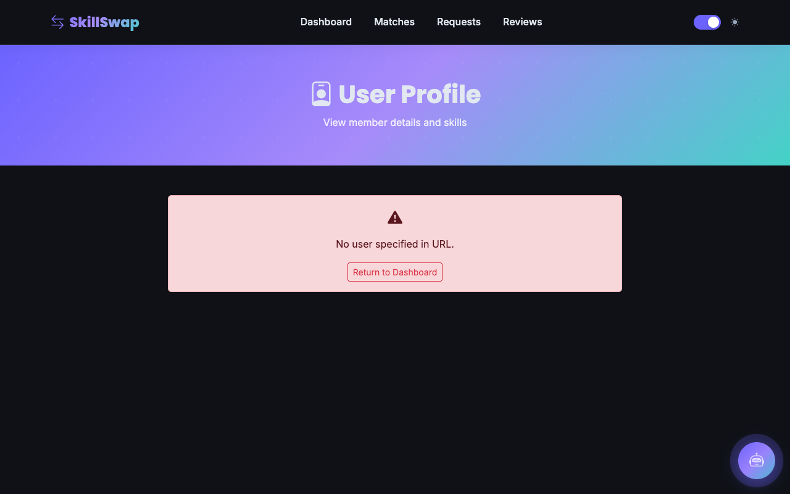
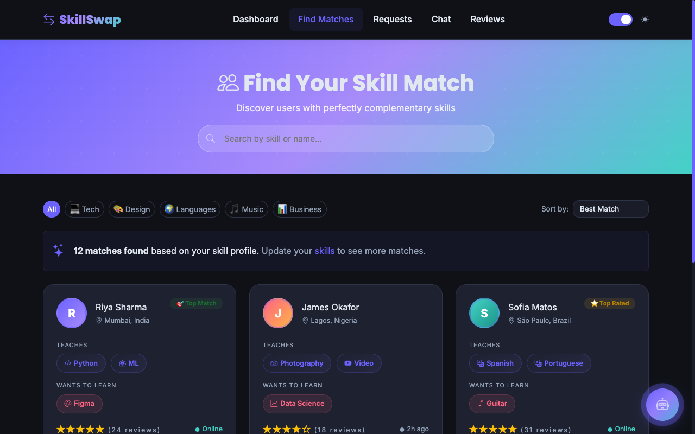
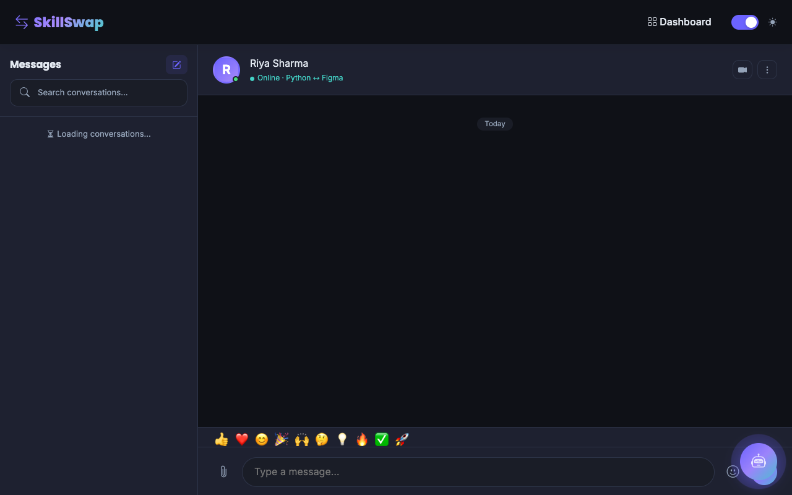

<div align="center">
  <h1>🌟 SkillSwap Platform</h1>
  <p><em>A modern web application where users exchange skills instead of money. Learn anything, teach anything — no money needed!</em></p>

  <!-- Badges -->
  <p>
    
    
    
    
    
    
    
  </p>
  <p>
    <a href="https://github.com/username/skillswap/stargazers"></a>
    <a href="https://github.com/username/skillswap/network/members"></a>
    <a href="LICENSE"></a>
  </p>
</div>

---

## 📑 Table of Contents

- [About the Project](#-about-the-project)
- [Project Screenshots](#-project-screenshots)
- [Demo Workflow](#-demo-workflow)
- [Features](#-features)
- [Tech Stack](#-tech-stack)
- [Project Structure](#-project-structure)
- [Database](#-database)
- [Installation Guide](#-installation-guide)
- [Firebase Setup](#-firebase-setup)
- [Configuration](#-configuration)
- [Usage](#-usage)
- [Future Improvements](#-future-improvements)
- [Contributors](#-contributors)
- [License](#-license)
- [Contact](#-contact)
- [Acknowledgements](#-acknowledgements)

---

## 🚀 About the Project

### Why SkillSwap was built
In a rapidly evolving world, acquiring new skills is essential. However, expensive courses and limited access to expert mentors can hold people back. SkillSwap was built to democratize education. 

### Problem Statement
People have valuable knowledge but lack the financial means to pay for learning new skills. Traditional platforms demand high subscription fees or upfront payments.

### Solution
**SkillSwap** allows users to exchange their knowledge. For example, if you know **Python** and want to learn **Graphic Design**, you can find a partner with the complementary needs. Time and knowledge are the only currencies used!

### Key Features
- Profile matching based on complementary skills.
- Real-time chat system between matches.
- Integrated video calling through Google Meet.
- Review and rating system to ensure quality.
- Secure Firebase authentication (Google, GitHub, Email).

---

## 📸 Project Screenshots

> **Note:** Replace the placeholder texts below with actual screenshots inside the `/docs/screenshots/` folder.

| Home Page | Dashboard |
| :---: | :---: |
|  |  |

| Login / Register | Profile & Settings |
| :---: | :---: |
|  |  |

| Skill Management | Match Users |
| :---: | :---: |
|  |  |

| Chat System | Video Meeting & Reviews |
| :---: | :---: |
|  |  |

| Notifications | Mobile Responsive View |
| :---: | :---: |
|  |  |

---

## 🛤️ Demo Workflow

1. **Register/Login:** Sign up using email/password, Google, or GitHub via Firebase.
2. **Add Skills:** Update your profile by specifying what you can *teach* and what you want to *learn*.
3. **Find Matches:** The system's algorithm displays users with complementary skills.
4. **Send Request:** Send a collaboration request to a potential match.
5. **Chat:** Once accepted, talk with your match in real-time.
6. **Video Call:** Launch a Google Meet session directly from the chat interface.
7. **Give Review:** Rate your session and write a review for your partner.
8. **Logout:** Securely log out across devices.

---

## ✨ Features

| Feature | Status |
| :--- | :---: |
| **Authentication (Firebase Login)** | ✅ |
| **Profile & Skill Management** | ✅ |
| **Skill Matching Algorithm** | ✅ |
| **Real-time Chat** | ✅ |
| **Notifications** | ✅ |
| **Reviews & Ratings** | ✅ |
| **Video Meeting Integration** | ✅ |
| **Responsive UI (Bootstrap 5)** | ✅ |

---

## 💻 Tech Stack

### Frontend
 
 
 


### Backend


### Database & Auth


### Tools


---

## 📁 Project Structure

```text
skillswap/
│
├── api/                     # PHP Backend Endpoints
├── assets/                  # Additional assets
├── components/              # Reusable UI components (e.g. chatbot.js)
├── config/                  # Database config and SQL schemas
├── css/                     # Stylesheets (style.css)
├── docs/
│   └── screenshots/         # Project screenshots
├── firebase/                # Firebase initialization scripts
├── images/                  # Static image resources
├── js/                      # Frontend JavaScript logic
├── uploads/                 # User uploaded files
│
├── add-skills.html          # Skill management page
├── chat.html                # Messaging interface
├── dashboard.html           # Main user dashboard
├── index.html               # Landing page
├── login.html               # User authentication
├── matches.html             # Profile discovery and matching
├── profile.html             # User profile settings
├── register.html            # Account registration
├── requests.html            # Incoming/outgoing requests
├── reviews.html             # Feedback and ratings
├── sessions.html            # Video sessions and tracking
│
└── README.md                # Project documentation
```

---

## 🗄️ Database

**Database Name:** `skillswap`

### Main Tables:
- `users`: Stores core profile data and Firebase UIDs.
- `skills`: Master list of available skills.
- `user_skills`: Junction table connecting users to the skills they teach or want to learn.
- `skill_requests`: Tracks collaboration requests (pending/accepted/rejected).
- `chat`: Stores all user-to-user messages.
- `reviews`: Stores feedback, ratings, and testimonials.
- `notifications`: System alerts and unread indicators.
- `meetings`: Video call scheduling data.
- `blocked_users`: Handles user blocking functionality.
- `reports`: Tracks reported interactions for moderation.

---

## 🛠️ Installation Guide

Follow these steps to run the platform locally on your machine using Homebrew (macOS/Linux).

### 1. Clone Repository
```bash
git clone https://github.com/username/skillswap.git
cd skillswap
```

### 2. Install Requirements
```bash
brew install php
brew install mysql
```

### 3. Start MySQL Service
```bash
brew services start mysql
```

### 4. Create Database & Import SQL
```bash
mysql -u root -e "CREATE DATABASE IF NOT EXISTS skillswap;"
mysql -u root skillswap < config/schema_new.sql
mysql -u root skillswap < config/schema_sessions.sql
mysql -u root skillswap < config/seed.sql
```

### 5. Configure Database
Update `config/db.php` if necessary. Ensure the host is set correctly for Homebrew:
```php
define('DB_HOST', '127.0.0.1');
define('DB_NAME', 'skillswap');
define('DB_USER', 'root');
define('DB_PASS', '');
```

### 6. Run the Application
Start the built-in PHP development server:
```bash
php -S localhost:8000
```

### 7. Open Application
Navigate to [http://localhost:8000](http://localhost:8000) in your web browser.

---

## 🔥 Firebase Setup

SkillSwap uses Firebase for secure user authentication.

1. **Create Firebase Project:** Go to the [Firebase Console](https://console.firebase.google.com/) and create a new project.
2. **Enable Authentication:** Navigate to **Authentication** > **Sign-in method**.
3. **Enable Providers:** 
   - Email/Password
   - Google Login
   - GitHub Login
4. **Copy Firebase Config:** Go to Project Settings and register a web app. Copy the `firebaseConfig` object.
5. **Paste into Code:** Open `firebase/firebase-config.js` and paste your config variables:

```javascript
const firebaseConfig = {
  apiKey: "YOUR_API_KEY",
  authDomain: "YOUR_PROJECT_ID.firebaseapp.com",
  projectId: "YOUR_PROJECT_ID",
  storageBucket: "YOUR_PROJECT_ID.appspot.com",
  messagingSenderId: "YOUR_SENDER_ID",
  appId: "YOUR_APP_ID"
};
```

---

## ⚙️ Configuration

- **Database Config (`config/db.php`):** Contains PDO configuration and MySQL connection strings.
- **Firebase Config (`firebase/firebase-config.js`):** Contains the SDK setup for authentication.
- **Environment Variables:** Currently managed directly inside configuration files. For production, move credentials out of source control.

---

## 📖 Usage

- **Registration/Login:** Create a new account securely.
- **Dashboard:** View an overview of your activity, notifications, and upcoming sessions.
- **Skill Matching:** Visit the "Find Matches" tab to look for partners. Click "Send Request" to connect.
- **Messaging:** Once connected, use the Chat panel to coordinate schedules.
- **Video Call:** Click the meeting icon in the chat interface to generate and join a Google Meet room.
- **Review:** After the session ends, navigate to the Reviews section to rate your partner's teaching ability.

---

## 🔮 Future Improvements

- [ ] **AI Skill Recommendation:** Automatically suggest skills based on trends and user behavior.
- [ ] **Mobile App:** Build native iOS and Android apps using React Native or Flutter.
- [ ] **Better Matching:** Enhance the algorithm to factor in user ratings, timezone availability, and language fluency.
- [ ] **Gamification:** Introduce badges, streaks, and experience points (XP) for completed sessions.
- [ ] **Push Notifications:** Web and mobile push notifications for messages and requests.
- [ ] **Real Video Calling:** Integrate WebRTC or specialized video APIs (like Twilio) directly within the app UI.
- [ ] **Multi-language Support:** i18n support to allow global skill exchanges.

---

## 👥 Contributors

- **[Your Name/Team Member]** - *Lead Developer* - [GitHub Profile](https://github.com/username)

> *Want to contribute? Please fork the repository and create a pull request!*

---

## 📄 License

This project is licensed under the **MIT License**. See the [LICENSE](LICENSE) file for more information.

---

## 📬 Contact

- **GitHub:** [@username](https://github.com/username)
- **LinkedIn:** [Your Name](https://linkedin.com/in/username)
- **Email:** your.email@example.com

---

## 🙏 Acknowledgements

- [Bootstrap 5](https://getbootstrap.com/) for the responsive UI framework.
- [Firebase](https://firebase.google.com/) for seamless authentication.
- [PHP](https://www.php.net/) & [MySQL](https://www.mysql.com/) for a robust open-source backend stack.
- The Open Source Community for continuous inspiration and support.
