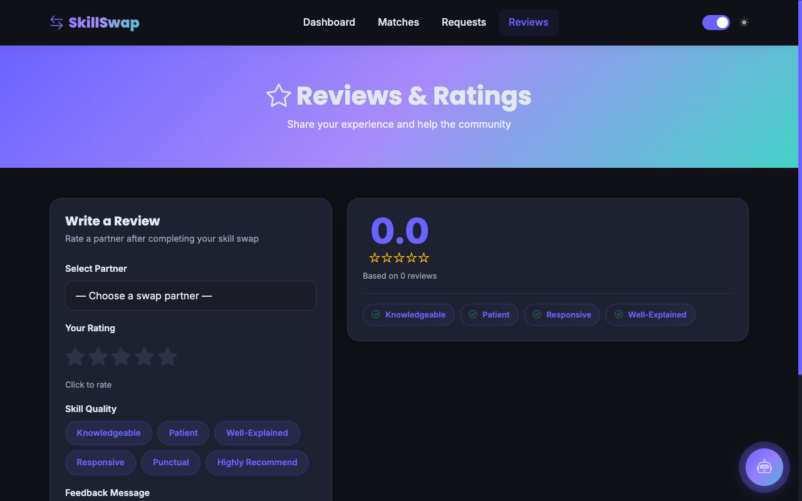
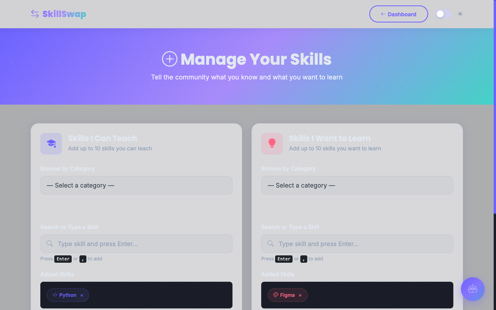
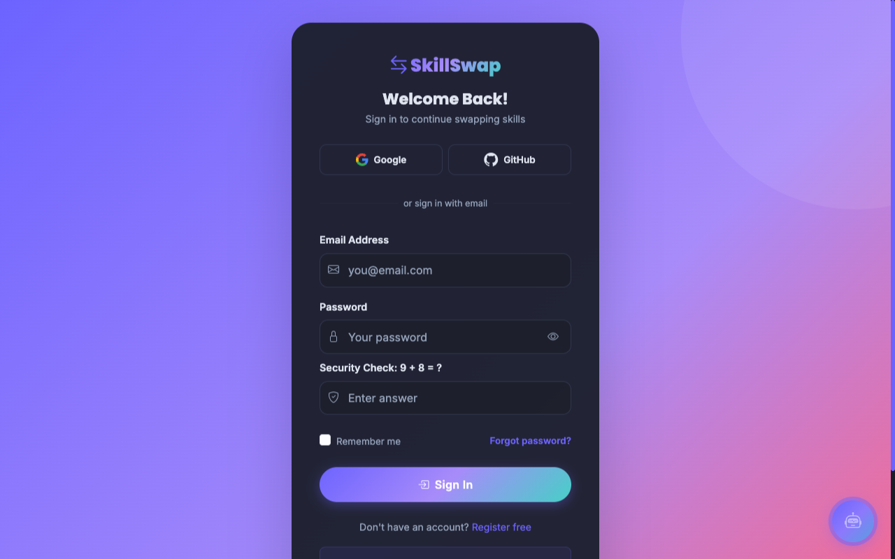
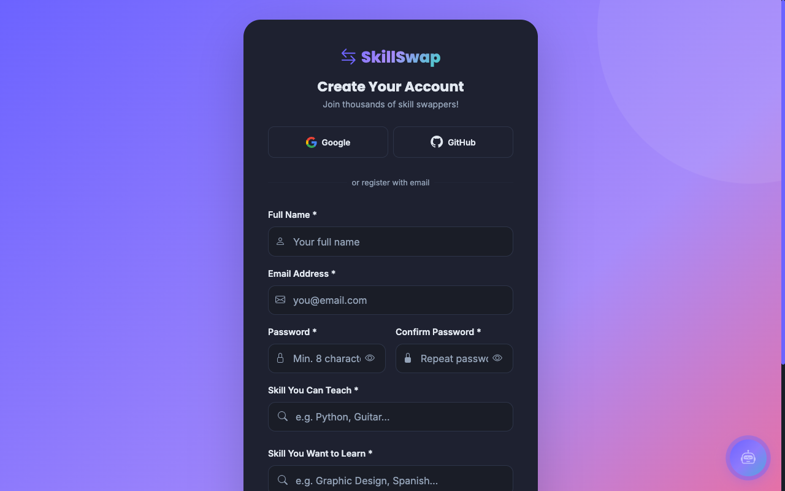

<div align="center">
  

  <h1 align="center">SkillSwap</h1>
  <h3>Learn Skills • Teach Skills • Connect with People</h3>

  <p align="center">
    A modern web application where users exchange skills instead of money!
  </p>


  <p align="center">
    
    
    
    
    
    
  </p>

  <p align="center">
    
    
    
    
    
  </p>
</div>

## 🌐 Live Demo

> **Website:**  
> [](https://skillswap.wuaze.com)

---

<details>
  <summary><b>📑 Table of Contents</b> (Click to expand)</summary>
  <ul>
    <li><a href="#-project-overview">Project Overview</a></li>
    <li><a href="#-features">Features</a></li>
    <li><a href="#-screenshots">Screenshots</a></li>
    <li><a href="#-project-structure">Project Structure</a></li>
    <li><a href="#-tech-stack">Tech Stack</a></li>
    <li><a href="#-system-architecture">System Architecture</a></li>
    <li><a href="#-database">Database</a></li>
    <li><a href="#-how-to-install">How to Install</a></li>
    <li><a href="#-firebase-setup">Firebase Setup</a></li>
    <li><a href="#-project-demo">Project Demo</a></li>
    <li><a href="#-roadmap">Roadmap</a></li>
    <li><a href="#-contributing">Contributing</a></li>
    <li><a href="#-license">License</a></li>
    <li><a href="#-author">Author</a></li>
  </ul>
</details>

---

## 📖 Project Overview

**SkillSwap** is an innovative platform built to democratize education. In a world where high-quality courses can be expensive, SkillSwap offers a peer-to-peer ecosystem where knowledge and time are the only currencies. 

### Why it was built
Traditional platforms often place up-front financial barriers on learning. We wanted to build a place where anyone with a skill to share could trade it directly for a skill they want to learn.

### Problems Solved
- **Cost of Education:** Completely free peer-to-peer learning.
- **Accessibility:** Learn from practitioners around the globe.
- **Networking:** Meaningful connections built on mutual growth.

### Target Users
- Students seeking specialized knowledge.
- Professionals looking to cross-train or upskill.
- Hobbyists willing to share their passions.

### Objectives
To provide a seamless, secure, and engaging environment for users to discover complementary skills, arrange meetings, and learn through a modern web interface.

---

## ✨ Features

SkillSwap is packed with modern capabilities to ensure a secure and smooth user experience.

| Authentication & Profiles | Core Features | Notifications & UI |
| :--- | :--- | :--- |
| ✔️ **Firebase Auth** | ✔️ **Skill Matching** | ✔️ **In-App Notifications** |
| ✔️ **Google Login** | ✔️ **Request System** | ✔️ **Dark Mode** |
| ✔️ **GitHub Login** | ✔️ **Real-time Chat** | ✔️ **Mobile Responsive** |
| ✔️ **Email Login** | ✔️ **Google Meet Integration** | ✔️ **Secure Database** |
| ✔️ **Profile Management** | ✔️ **Reviews & Ratings** | ✔️ **Online Status** |
| ✔️ **User Dashboard** | ✔️ **Advanced Search** | ✔️ **Modern Animations** |

---

## 📸 Screenshots

Here is a visual tour of the platform:

| Home Page | Dashboard | Chat |
| :---: | :---: | :---: |
|  |  |  |

| Matches | Reviews | Profile |
| :---: | :---: | :---: |
|  |  |  |

| Settings | Login | Register |
| :---: | :---: | :---: |
|  |  |  |

---

## 📁 Project Structure

```text
SkillSwap
│
├── api/                   # PHP Backend Endpoints
├── assets/                # Core Assets & Styling
├── components/            # Reusable JS/UI Components
├── config/                # Database Configuration & Schema
├── css/                   # Cascading Style Sheets
├── docs/
│   └── screenshots/       # Application Previews
├── firebase/              # Firebase Initialization logic
├── images/                # Static Image Assets
├── js/                    # Core JavaScript logic & API wrappers
├── uploads/               # User File Uploads
│
├── add-skills.html        # Skill/Settings Configuration
├── chat.html              # Real-time Messaging Interface
├── dashboard.html         # Main User Dashboard
├── index.html             # Landing Page
├── login.html             # User Authentication
├── matches.html           # Skill Matching Interface
├── profile.html           # User Profile Viewer
├── register.html          # Account Registration
├── requests.html          # Manage Collaboration Requests
├── reviews.html           # View and Submit Feedback
├── sessions.html          # Video Call Sessions
└── README.md              # Project Documentation
```

---

## 💻 Tech Stack

| Category | Technologies |
| :--- | :--- |
| **Frontend** | <a href="https://skillicons.dev"></a> |
| **Backend** | <a href="https://skillicons.dev"></a> |
| **Database** | <a href="https://skillicons.dev"></a> |
| **Authentication** | <a href="https://skillicons.dev"></a> |
| **Tools** | <a href="https://skillicons.dev"></a> |

---

## 🏛️ System Architecture

### High-Level Architecture

SkillSwap follows a modern three-layer architecture consisting of:

- **Presentation Layer**
  - Responsive HTML5 interface
  - CSS3 styling
  - JavaScript interactions
  - User Dashboard

- **Application Layer**
  - PHP Backend
  - Business Logic
  - Matching Engine
  - Chat Module
  - Review System
  - Notification System

- **Data Layer**
  - MySQL Database
  - Firebase Authentication
  - Firebase User Management

```text
                User
                  │
                  ▼
     HTML • CSS • JavaScript
                  │
                  ▼
 Firebase Authentication
                  │
                  ▼
        PHP Backend APIs
                  │
      ┌───────────┼───────────┐
      │           │           │
      ▼           ▼           ▼
 Matching     Chat      Notifications
      │           │           │
      └───────────┼───────────┘
                  ▼
        Reviews & Ratings
                  │
                  ▼
          MySQL Database
```

---

## 🗄️ Database

The system utilizes a fully normalized MySQL relational database consisting of the following core tables:

- **Users:** Stores core profile data linked to Firebase UID.
- **Skills:** Master repository of system skills.
- **User_Skills:** Junction table linking users to what they learn/teach.
- **Skill_Requests:** Manages connection requests.
- **Chat:** Stores real-time messages.
- **Reviews:** User ratings and session feedback.
- **Meetings:** Video call session tracking.
- **Notifications:** Alerts for matches and messages.
- **Blocked_Users:** Moderation tracking.
- **Reports:** System abuse reporting.

---

## ⚙️ How to Install

Follow this guide to get a local development environment running seamlessly on macOS using Homebrew.

### 1. Clone the Repository
```bash
git clone https://github.com/Manantote/SkillSwap-Platform.git
cd skillswap
```

### 2. Install Dependencies (macOS Homebrew)
```bash
brew install php
brew install mysql
```

### 3. Start MySQL Service
```bash
brew services start mysql
```

### 4. Create Database & Import SQL
```bash
mysql -u root -e "CREATE DATABASE IF NOT EXISTS skillswap;"
mysql -u root skillswap < config/schema_new.sql
```

### 5. Configure Firebase
Ensure your `firebase/firebase-config.js` is set up with your actual Firebase project credentials (see below).

### 6. Run PHP Server
```bash
php -S localhost:8000
```

### 7. Open Application
Navigate to **[https://skillswap.wuaze.com](https://skillswap.wuaze.com)** in your browser!

---

## 🔥 Firebase Setup

The application relies heavily on Firebase Authentication for secure access.

1. **Create Project:** Go to the [Firebase Console](https://console.firebase.google.com/) and create a project.
2. **Enable Authentication:**
   - Email/Password
   - Google Login
   - GitHub Login
3. **Password Reset:** Enable forgot password templates within the Firebase dashboard.
4. **Copy Config:** Retrieve your web configuration keys.
5. **Paste Config:** Overwrite the placeholder variables in `firebase/firebase-config.js`:
   ```javascript
   const firebaseConfig = {
     apiKey: "YOUR_API_KEY",
     authDomain: "YOUR_PROJECT_ID.firebaseapp.com",
     projectId: "YOUR_PROJECT_ID",
     storageBucket: "YOUR_PROJECT_ID.appspot.com",
     messagingSenderId: "YOUR_SENDER_ID",
     appId: "YOUR_APP_ID"
   };
   ```

---

## 🚀 Project Demo

The standard user lifecycle on the platform:

`Register` ➔ `Login` ➔ `Create Profile` ➔ `Add Skills` ➔ `Find Match` ➔ `Send Request` ➔ `Accept` ➔ `Chat` ➔ `Google Meet` ➔ `Review`

---

## 🗺️ Roadmap

**✅ Completed**
- [x] Firebase Authentication
- [x] Profile & Skill Management
- [x] Real-time Chat
- [x] Dashboard & Matching
- [x] Session Reviews

**🚀 Upcoming**
- [ ] AI Skill Recommendation Engine
- [ ] Verifiable Skill Certificates
- [ ] Centralized Admin Panel
- [ ] In-App Voice Chat
- [ ] Native Mobile App (React Native/Flutter)
- [ ] Escrow / Payment System (Optional Tipping)

---

## 🤝 Contributing

Contributions are what make the open source community such an amazing place to learn, inspire, and create. Any contributions you make are **greatly appreciated**.

1. Fork the Project
2. Create your Feature Branch (`git checkout -b feature/AmazingFeature`)
3. Commit your Changes (`git commit -m 'Add some AmazingFeature'`)
4. Push to the Branch (`git push origin feature/AmazingFeature`)
5. Open a Pull Request

---

## 📜 License

Distributed under the **MIT License**. See `LICENSE` for more information.

---

## 👤 Author

<div align="center">
  <h3><b>Manan Vivekanand Tote</b></h3>
  <p>
    <a href="https://github.com/Manantote"></a>
    <a href="https://linkedin.com/in/manantote"></a>
    <a href="mailto:your.email@example.com"></a>
  </p>
</div>

---

<div align="center">
  <b>⭐ If you like this project, give it a Star on GitHub!</b><br>
  <i>Made with ❤️ by Manan Vivekanand Tote</i>
</div>
